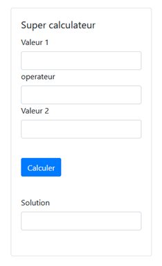

web3-sommatif-1 
Les bases du Javascript

# Objectif
Programmer ce super calculateur en JavaScript:

# Consigne
Vous devez programmer un formulaire web comprenant les éléments ci-dessous.  Vous devez avoir des fichiers séparés pour le HTML et le JavaScript.   
L'apparence du formulaire est prise en charge par la bibliothèque graphique "Bootstrap".
Le formulaire comprend quatre champs et un bouton "calculer":
1.	Valeur1 : Prends une valeur (chaine ou numérique)
2.	Opérateur : Prend les valeurs suivantes : +, -, *, /, **, {tous les autres}  
3.	Valeur2 : Prends une valeur (chaine ou numérique)
4.	Solution : Affiche les résultats suivants selon l’opérateur utilisé lorsqu’on clique sur le bouton Calculer.
-	'+' : La somme de valeur1 et valeur2
-	'-' : La différence de valeur1 et valeur2
-	'*' : La multiplication de valeur1 et valeur2
-	'/' : La division de valeur1 et valeur2
-	'**' : L’exposant Valeur2 de la valeur1
-	'n’importe quoi d’autre' : La concaténation de valeur1 et valeur2

# Remise et barème de correction
- Assurez-vous que votre code final est dans la branche Main, et qu’il a été « commit » et « push » sur le serveur Github.
- Votre code sera révisé directement sur Github à partir de la pull-request "feedback".  Vous receverez une note sur 5 ainsi que des commentaires sur votre code.
- Vous aurez alors une opportunité de corriger votre code et mettre à jour votre pull-request.  Votre note pourra augmenter jusqu'à un maximum de 20% si vous apportez les corrections appropriées.
- ATTENTION, dans le cas où un étudiant ne fait pas une première remise, celui-ci n’aura pas le droit à la seconde remise.  L’intérêt de la deuxième remise est d’offrir une rétroaction et non d’allouer du temps supplémentaire.

# Date limite de remise :
- La première pull-request doit être fait avant jeudi le 31 août à la fin de la journée.
- La seconde remise doit être faite, au plus tard, une semaine après la révision de code.

